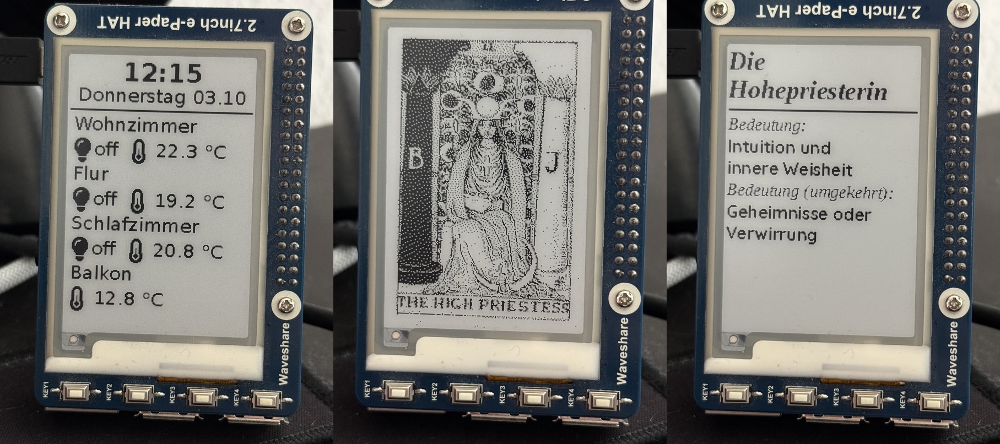

# Python experiments with waveshare 2.7 inch eink-display

_Disclaimer:_ This is not a polished project, but instead just a bunch of experiments. Thus, code quality may be a bit of a mess. Please only run this if you know what you're doing!



This repository contains a set of experiments to display information on a [Waveshare 2.7-inch e-ink display](https://www.waveshare.com/wiki/2.7inch_e-Paper_HAT) using Python. The display interfaces with Home Assistant via a REST API, and the hardware buttons are used to interact with the display, such as navigating through content or selecting options.

## Features

- **Home Assistant Integration**: Display data from Home Assistant entities, with updates pushed to the e-ink display.
- **Random Tarot Cards**: Select and display a random tarot card, with the option to navigate to its meaning using the hardware buttons. (_I have actually no idea about tarot, the meanings were generated with chat-gpt and are actually in german_)
- **Twitch Chat Display**: Show live chat from a configured Twitch channel directly on the e-ink display.

## Requirements

- [Waveshare 2.7-inch e-ink display](https://www.waveshare.com/wiki/2.7inch_e-Paper_HAT)
- Python 3.x
- [rpi_epd2in7 library](https://github.com/elad661/rpi_epd2in7) for controlling the Waveshare display
- Home Assistant REST API
- Twitch API Token (if you want to try the chat integration)

## Setup

1. Clone this repository

2. Install required Python packages:

   ```bash
   pip install -r requirements.txt
   ```

3. Install the [rpi_epd2in7 library](https://github.com/elad661/rpi_epd2in7) for controlling the Waveshare display (follow its readme)

4. Configure Home Assistant and Twitch API credentials in a `.env` file as needed.

5. Unpack the cards.zip using `this-is-a-deck-78`. Make sure the output files are in the `/cards` subfolder.

6. Connect your Waveshare e-ink display and hardware buttons to your Raspberry Pi or similar device.

## Scripts

### 1. `homie_combined.py`

A basic Home Assistant dashboard for the e-ink display. This script displays various data from Home Assistant entities, such as temperature, humidity, and other states. It also allows you to display a random tarot card when the hardware button is pressed.

**Features**:

- Displays data from Home Assistant.
- Press a hardware button to show a random tarot card.

### 2. `tarot.py`

This script focuses on displaying random tarot cards. Users can cycle through the cards using the hardware buttons, and navigate to a detailed description of each card's meaning.

**Features**:

- Shows a random tarot card on the display.
- Navigate to the meaning of the card using hardware buttons.

### 3. `chat.py`

Displays live Twitch chat from a specified channel on the e-ink display. Requires the Twitch API and proper channel configuration.

**Features**:

- Displays the chat feed of a configured Twitch channel on the display.
- Updates the feed in real-time.

### 4. `start.sh`

This is a helper script to start the `homie_combined.py` script in an endless loop, capturing any errors and logging them for debugging purposes. It ensures that the script automatically restarts in case of an error.

**Usage**:
The `start.sh` script takes one parameter, which is the directory containing the `homie_combined.py` Python script. It will continuously run the script, and any errors will be logged to a `log.txt` file within the specified directory.

**Example**:

```bash
./start.sh /path/to/directory/ha-display-experiments-python-epd2in7/
```

- The script starts the `homie_combined.py` script in an infinite loop.
- Any errors or exceptions from the script are logged in `log.txt` within the provided directory.
- If the script crashes, it will automatically restart after a brief delay.

## Hardware Setup

You will need to set up the Waveshare 2.7-inch e-ink display with the Raspberry Pi and connect hardware buttons for interacting with the display. Follow Waveshare's official setup guide for connecting the display and installing the necessary drivers.

## License

This project is licensed under the MIT License.
